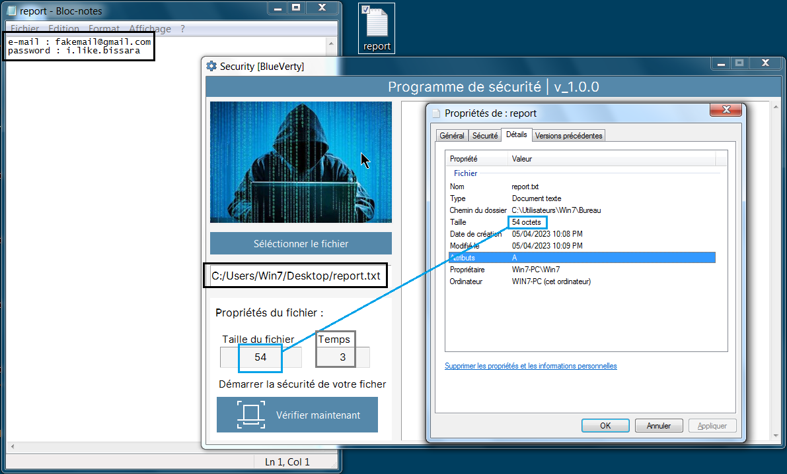
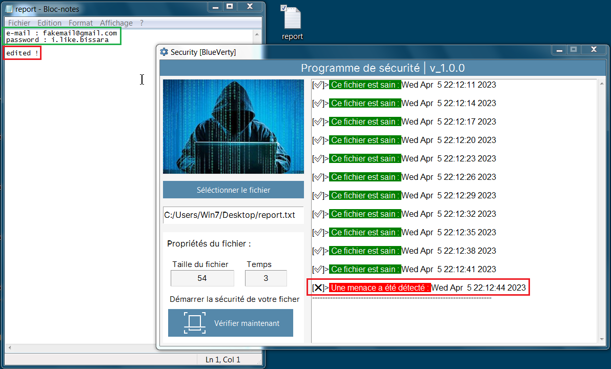

# Security Program
## Description
Create your own standard **Security Program** App with *Python 3* and *tkinter library*.

> *Tkinter is already in your python's workstation without any *pip* installation.*

This app can used for Text files (.txt | .md), PDF files, Word files (.docx), PPT files (.pptx)

Follow the screenshots for using this app:

## Screenshot





---

## Create Standalone Executable
Of course, with python you can convert main file (.py) to executable file (.exe), just a few script in powershell or cmd if you work on windows environment:

```shell
pip install pyinstaller
pyinstaller --onefile -w main.py
```
